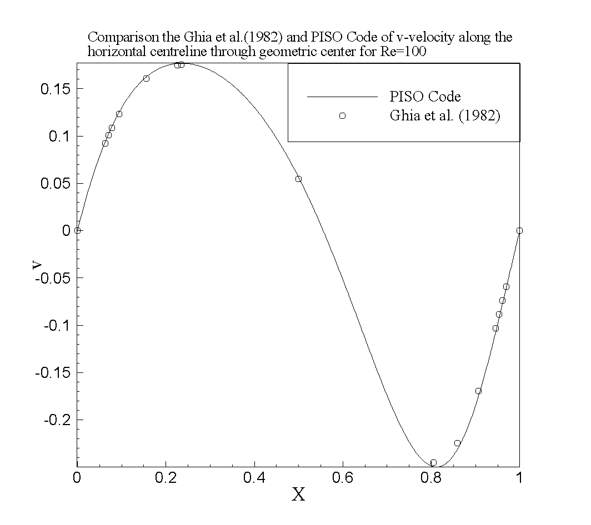

# How to run `CAVITY_2D_STAGGERED.F90`

In Linux, it may be built with `gfortran`.  The `Makefile` is provided
for the Linux platform.  (In Windows, it may be built with visual studio
2010 and intel fortran compiler.)  In this directory, build the code
like:

```bash
$ make
gfortran -O3 CAVITY_2D_STAGGERED.F90 -o CAVITY_2D_STAGGERED
```

Run the code:

```bash
$ ./CAVITY_2D_STAGGERED
           1   1.95312503E-04   6.84099179E-03   1.24235293E-02   2.88521945E-02
           2   1.53592497E-04   1.01379249E-02   6.67265477E-03   4.73801903E-02
           ...
```

## Files included

* `CAVITY_2D_STAGGERED.F90`: Fortran source code
* `u-y_re100.png`: Comparison the Ghia et al. (1982) and PISO Code of
  u-velocity along the vertical centreline through geometric center for
  Re=100.  
* `x-v_re100.png`: Comparison the Ghia et al. (1982) and PISO Code of
  v-velocity along the horizontal centreline through geometric center
  for Re=100.  
* `schematic_diagram`: The schematic diagram of two dimension cavity
  flow.

## Problem description

We introduced a two-dimensional Pressure-Implicit with Splitting
Operators (PISO) scheme to simulate the laminar incompressible flow in a
unit square cavity whose top wall moves with a uniform velocity serves
as a model problem to test and evaluate the unified wall-boundary
condition.

## Results

The results shown in `u-y_re100.png` and `x-v_re100.png` well agree with
the those by Ghia et al. (1982)
